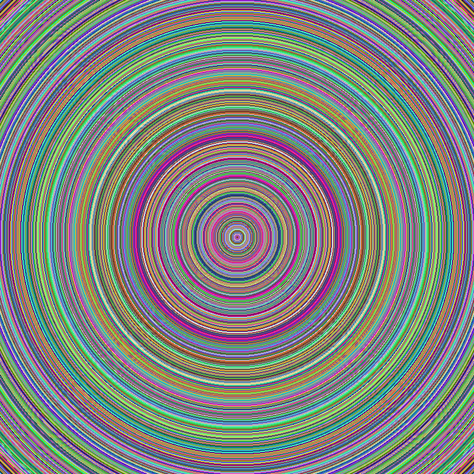

# ePNG
Um codificador PNG sem perdas, sem dependências, compacto e simples, que gera imagens de 8 bits por amostra. Todos os 5 tipos de cores (GRAYSCALE, RGB, PALETTE, GRAYSCALE ALPHA, RGBA) são suportados e o mesmo é escolhido com base na estatística das amostras.

Imagem ilustrativa gerada com ePNG

#### Exemplo de uso

    let png = new ePNG(data, width, height [, filter]);
    png.encode().then(blob => {
       let url = window.URL.createObjectURL(blob);
       let img = document.createElement('img');
       img.src = url;
       document.body.append(img);
    });

**data** é um array com as amostras da imagem no formato RGBA. Se a imagem não possuir transparência o canal alpha deve ser preenchido com o valor 255.

**width** é a largura da imagem.

**height** é a altura da imagem.

**filter** é o filtro predefinido a ser aplicado à todas as scanlines. Este parâmetro aceita valores de 0 a 4. Se este não estiver no range permitido ou não fornecido será aplicada uma filtragem dinâmica conhecida como heurística da *soma mínima das diferenças absolutas*. Em imagens PALETTE o filtro será sempre 0.

O método **encode()** retorna uma Promise que resolve com um Blob contendo os dados binários da imagem, que pode ser transmitido pela rede ou exibido na própria página.

O codificador escolhe o tipo de cor com base na análise do canal alpha, quantidade e tipo de cores nas amostras passadas para o construtor. A compressão Zlib é fornecida pela Compression Streams API. Esta API Javascript conta com ampla compatibilidade nos navegadores modernos.

Veja um exemplo comparativo de resultados com tipos de filtro diferentes. Leve em conta que o tipo de imagem influencia diretamente na eficiência da filtragem e consequente compactação.

[Demonstração de uso online](https://nildopontes.com.br/ePNG/examples.html)
